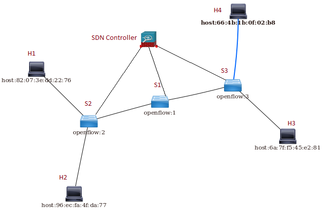

# **SOFTWARE DEFINED NETWORK(SDN) BASED FIREWALL**.  

**Description**:

OpenDaylight is an open source platform for enabling SDN and NFV.The OpenDaylight controller has numerous APIs for interaction with the Application layer called as the “Northbound APIs”. It also has APIs to interact with the original hardware to translate the design and topology specified by the network administrator as the “Southbound APIs”.

The aim of the project is to implement firewall rules:  
-Permit/Deny packets based on Protocol (IP/ICMP/YCP/UDP).  
-Permit/Deny packets based on Layer 4 Address including address ranges and known services.  
-Permit/Deny packets based on Layer 3 Address including wildcard matches.  
-Permit/Deny packets based on Layer 2 Address.  

The Sample topology is as follows.  
  

The sample topology is a tree like topology with 4 hosts and 3 switches. 2 hosts connected to each border switches and border networks connected by an intermediate switch.  

The sample topology can be simulated using a tool named Mininet which can be installed from  
<http://mininet.org/>  

The command for above topology is:  

**sudo mn --controller remote,ip=127.0.0.1 --topo=tree,2**.    

Refer other folders for flows related to various test cases.  

